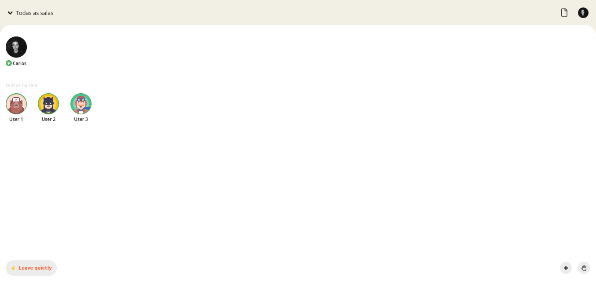
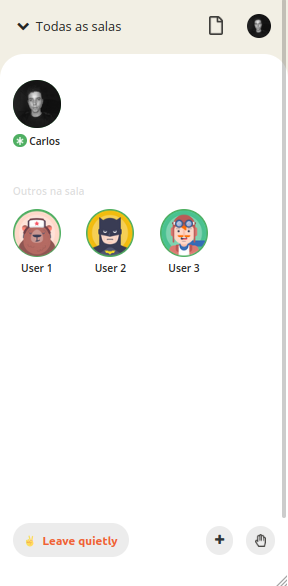

# Call-Club

## 🔖 Sobre
Durante a Semana JS Expert, ministrada pelo [Erick Wendel](https://github.com/ErickWendel), desenvolvemos um app que teve como inspiração o Clubhouse. Com propósitos
semelhantes, o Call-Club oferece um ambiente de bate-papo por voz, em que basta o usuário se logar com a conta github e terá acesso a todas as funcionalidades.

</br>

<p align="center"> 
  
  
</p>

</br>

## 🚀 Tecnologias utilizadas

- [Node](https://nodejs.org/en/)
- [Socket.io](https://socket.io/)
- [PeerJS](https://peerjs.com/)
- [Firebase](https://firebase.google.com/?gclid=CjwKCAjw-qeFBhAsEiwA2G7Nl3Goc6fBI_ND9QVA505zJARuQgIa17_0MrTss7a5hLPR87Z2jd3s3xoCoF8QAvD_BwE&gclsrc=aw.ds)


## 🗂 Como baixar e iniciar o projeto

### API (Back-end)

```bash
# Abra um terminal e copie este repositório com o comando
$ git clone https://github.com/carlos-mattos/proffy.git
# ou use a opção de download.

# Entre na pasta server 
$ cd proffy/server

# Instale as dependências
$ yarn install

# Rode o servidor
$ yarn start
```
e o QR Code exibido na janela do navegador.
```
<br>

Desenvolvido por [Carlos Eduardo](https://www.linkedin.com/in/carlos-eduardo-andrade-de-mattos-a060b1182/) 🤓
